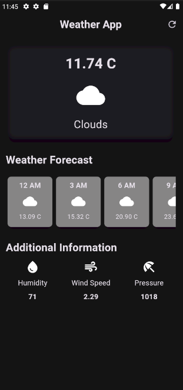
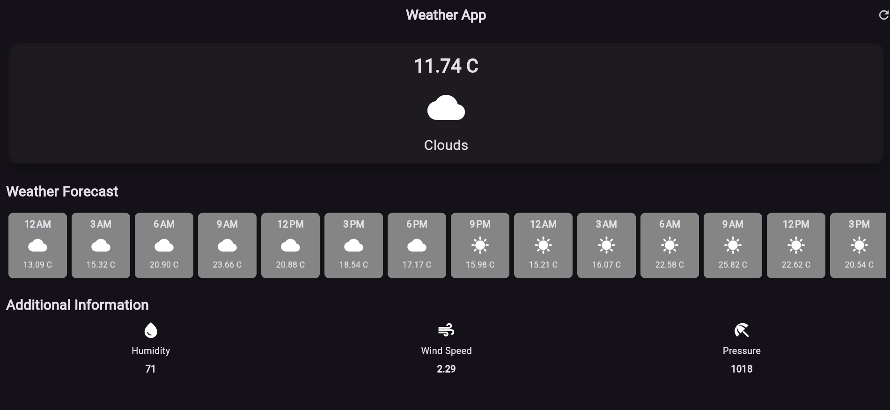

# Weather-APP

A new Flutter project.

## Features

- Current Weather: Displays the current temperature in Celsius along with an icon representing the weather condition (sunny, cloudy, rainy, etc.).

- 9-Hour Forecast: Provides a forecast for the next 9 hours.

- Additional Information: Shows humidity, wind speed, and pressure.

- Forecast Cards: Uses the ListView.builder widget to display forecast cards for upcoming weather

## Screenshots


## Installation

### 1.Clone the repository:
```
git clone https://github.com/yourusername/weather_app.git
cd weather_app
```

### 2.Get packages:
```
flutter pub get
```

### 3.Run the app:
```
flutter run
```


## Configuration

### 1.API key:
- Obtain an API key from OpenWeatherMap.
- Create a .env file in the root directory of your project and add your API key

```
OPENWEATHER_API_KEY=your_api_key_here
```

### 2.Update pubspec.yaml:

- Ensure the flutter_dotenv package is included in your pubspec.yaml

```
dependencies:
  flutter:
    sdk: flutter
  flutter_dotenv: ^5.0.2
```


## Usage

### 1.Home Screen:
- Displays the current temperature in Celsius.
- Shows an icon based on the weather condition (sunny, cloudy, rainy, etc.).
- Provides additional weather information: humidity, wind speed, and pressure.

### 2.Forecast Screen:
- Displays a 9-hour forecast using cards created with the ListView.builder widget.

